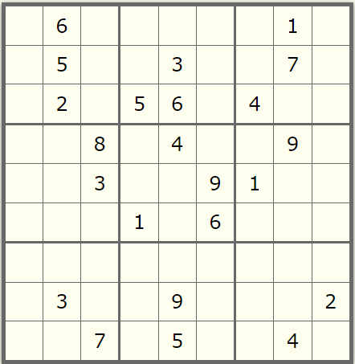

# Sudoku Solver

This program solves a given Sudoku puzzle and prints out the solution.
If the puzzle have no solutions, the program prints "No solutions".

## Usage Instructions

Compile and run the program.

To enter the puzzle, enter the numbers in each row one by one from top to bottom and replace the unknown numbers with 0.

For example,





the input for this puzzle should be:

```
0 6 0 0 0 0 0 1 0
0 5 0 0 3 0 0 7 0
0 2 0 5 6 0 4 0 0
0 0 8 0 4 0 0 9 0
0 0 3 0 0 9 1 0 0
0 0 0 1 0 6 0 0 0
0 0 0 0 0 0 0 0 0
0 3 0 0 9 0 0 0 2
0 0 7 0 5 0 0 4 0
```

The program will then print the solved sudoku in a similiar manner.

For this example, it will print:

```
3 6 4 7 2 8 9 1 5 
8 5 1 9 3 4 2 7 6 
7 2 9 5 6 1 4 3 8 
2 1 8 3 4 5 6 9 7 
6 7 3 2 8 9 1 5 4 
4 9 5 1 7 6 8 2 3 
5 4 2 8 1 3 7 6 9 
1 3 6 4 9 7 5 8 2 
9 8 7 6 5 2 3 4 1
```
